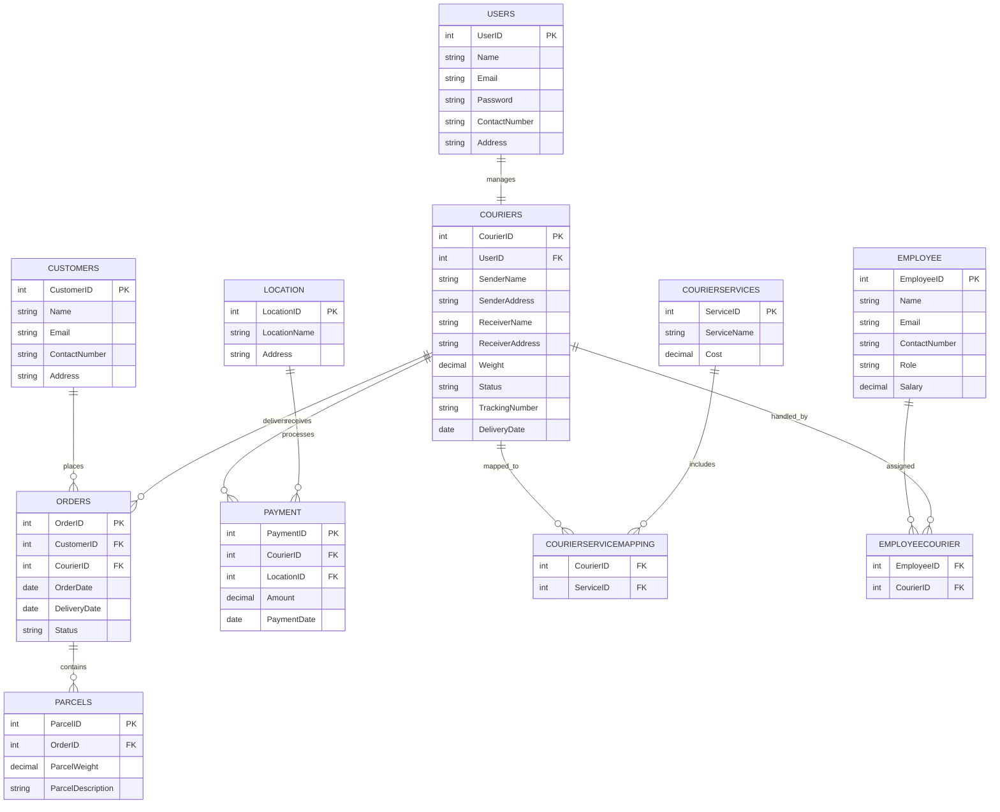

# Courier Management System

The Courier Management System is designed to manage courier deliveries,
customers, parcels, payments, and employee assignments using SQL and Python.
The project demonstrates database management concepts including ER modeling,
SQL queries, joins, aggregate functions, and Python database connectivity.

# Features

- Customer Management
- Courier Tracking
- Order Management
- Parcel Management
- Payment Tracking
- Employee Assignment
- Courier Service Mapping
- SQL Queries and Reports
- ER Diagram Representation

---

# Technologies Used

- SQL
- MySQL / SQL Server
- Mermaid ER Diagram
- Markdown Documentation

---

# Entity Relationship Diagram (ERD)



---

# Database Tables

| Table Name | Description |
|---|---|
| Users | Stores user information |
| Customers | Stores customer details |
| Couriers | Stores courier shipment data |
| Orders | Stores order information |
| Parcels | Stores parcel details |
| CourierServices | Stores courier service types |
| Employee | Stores employee information |
| Location | Stores branch/location details |
| Payment | Stores payment records |
| CourierServiceMapping | Maps couriers to services |
| EmployeeCourier | Maps employees to couriers |

---

# Relationships

| Relationship | Type |
|---|---|
| Customer → Orders | One-to-Many |
| Orders → Parcels | One-to-Many |
| Courier → Orders | One-to-Many |
| Courier → Payment | One-to-Many |
| Employee → EmployeeCourier | One-to-Many |
| CourierServices → CourierServiceMapping | One-to-Many |
| Location → Payment | One-to-Many |

---

# Sample SQL Operations

## Create Table

```sql
CREATE TABLE Customers (
    CustomerID INT PRIMARY KEY,
    Name VARCHAR(255),
    Email VARCHAR(255) UNIQUE,
    ContactNumber VARCHAR(20),
    Address TEXT
);
```

## Insert Data

```sql
INSERT INTO Customers (
    CustomerID,
    Name,
    Email,
    ContactNumber,
    Address
)
VALUES
(1, 'John Doe', 'john@example.com', '1234567890', '123 Main Street');
```

## Select Query

```sql
SELECT * FROM Customers;
```

---

# Project Structure

```text
Courier-Management-System/
│
├── README.md
├── Sql.md
├── schema.sql
└── queries.sql/
```

---

# Future Improvements

- Real-time tracking system
- Authentication and authorization
- REST API integration
- Admin dashboard
- Payment gateway integration
- Notification system

---

# Conclusion

This project demonstrates the implementation of a Courier Management System using SQL concepts including:

- Database Design
- ER Modeling
- SQL Queries
- Joins
- Aggregate Functions
- Subqueries
- Foreign Key Relationships

It serves as a strong academic mini-project for DBMS and SQL practice.
