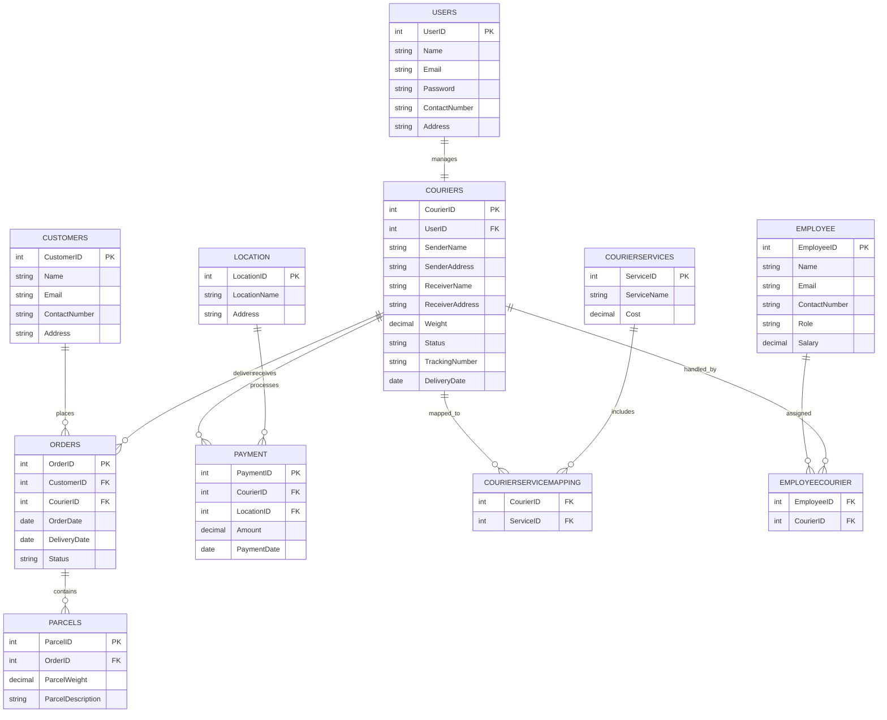

# Courier Management System

A complete SQL-based Courier Management System demonstrating:

- Database Design
- ER Diagram
- Table Creation
- Data Insertion
- SQL Queries
- Aggregate Functions
- Joins
- Subqueries
- Constraints and Relationships

---

# TASK 1 — Database Design

## 1.1 Entity Relationship Diagram (ERD)



---

# 1.2 Relationship Cardinality

| Relationship | Type |
|---|---|
| Parcel → Order | Many-to-One |
| Order → Customer | Many-to-One |
| Order → Courier | Many-to-One |
| Courier → User | One-to-One |
| Courier → Payment | One-to-Many |
| Courier → CourierServiceMapping | One-to-Many |
| Courier → EmployeeCourier | One-to-Many |
| Employee → EmployeeCourier | One-to-Many |
| CourierServices → CourierServiceMapping | One-to-Many |
| Location → Payment | One-to-Many |

---

# TASK 2 — Table Creation

## Users Table

```sql
CREATE TABLE Users (
    UserID INT PRIMARY KEY,
    Name VARCHAR(255),
    Email VARCHAR(255) UNIQUE,
    Password VARCHAR(255),
    ContactNumber VARCHAR(20),
    Address TEXT
);
```

## Customers Table

```sql
CREATE TABLE Customers (
    CustomerID INT PRIMARY KEY,
    Name VARCHAR(255),
    Email VARCHAR(255) UNIQUE,
    ContactNumber VARCHAR(20),
    Address TEXT
);
```

## Couriers Table

```sql
CREATE TABLE Couriers (
    CourierID INT PRIMARY KEY,
    UserID INT,
    SenderName VARCHAR(255),
    SenderAddress TEXT,
    ReceiverName VARCHAR(255),
    ReceiverAddress TEXT,
    Weight DECIMAL(5,2),
    Status VARCHAR(50),
    TrackingNumber VARCHAR(20) UNIQUE,
    DeliveryDate DATE,
    FOREIGN KEY (UserID) REFERENCES Users(UserID)
);
```

## Orders Table

```sql
CREATE TABLE Orders (
    OrderID INT PRIMARY KEY,
    CustomerID INT,
    CourierID INT,
    OrderDate DATE,
    DeliveryDate DATE,
    Status VARCHAR(50),
    FOREIGN KEY (CustomerID) REFERENCES Customers(CustomerID),
    FOREIGN KEY (CourierID) REFERENCES Couriers(CourierID)
);
```

## Parcels Table

```sql
CREATE TABLE Parcels (
    ParcelID INT PRIMARY KEY,
    OrderID INT,
    ParcelWeight DECIMAL(5,2),
    ParcelDescription TEXT,
    FOREIGN KEY (OrderID) REFERENCES Orders(OrderID)
);
```

## CourierServices Table

```sql
CREATE TABLE CourierServices (
    ServiceID INT PRIMARY KEY,
    ServiceName VARCHAR(100),
    Cost DECIMAL(8,2)
);
```

## Employee Table

```sql
CREATE TABLE Employee (
    EmployeeID INT PRIMARY KEY,
    Name VARCHAR(255),
    Email VARCHAR(255) UNIQUE,
    ContactNumber VARCHAR(20),
    Role VARCHAR(50),
    Salary DECIMAL(10,2)
);
```

## Location Table

```sql
CREATE TABLE Location (
    LocationID INT PRIMARY KEY,
    LocationName VARCHAR(100),
    Address TEXT
);
```

## Payment Table

```sql
CREATE TABLE Payment (
    PaymentID INT PRIMARY KEY,
    CourierID INT,
    LocationID INT,
    Amount DECIMAL(10,2),
    PaymentDate DATE,
    FOREIGN KEY (CourierID) REFERENCES Couriers(CourierID),
    FOREIGN KEY (LocationID) REFERENCES Location(LocationID)
);
```

## CourierServiceMapping Table

```sql
CREATE TABLE CourierServiceMapping (
    CourierID INT,
    ServiceID INT,
    FOREIGN KEY (CourierID) REFERENCES Couriers(CourierID),
    FOREIGN KEY (ServiceID) REFERENCES CourierServices(ServiceID)
);
```

## EmployeeCourier Table

```sql
CREATE TABLE EmployeeCourier (
    EmployeeID INT,
    CourierID INT,
    FOREIGN KEY (EmployeeID) REFERENCES Employee(EmployeeID),
    FOREIGN KEY (CourierID) REFERENCES Couriers(CourierID)
);
```

---

# TASK 3 — Insert Sample Data

## Customers Table

```sql
INSERT INTO Customers (CustomerID, Name, Email, ContactNumber, Address) VALUES
(1, 'John Doe', 'john@example.com', '1234567890', '123 Main Street'),
(2, 'Jane Smith', 'jane@example.com', '0987654321', '456 Elm Street'),
(3, 'Alice Johnson', 'alice@example.com', '9876543210', '789 Oak Street');
```

## Users Table

```sql
INSERT INTO Users (UserID, Name, Email, Password, ContactNumber, Address) VALUES
(101, 'John Smith', 'john.smith@example.com', 'password123', '1234567890', '123 Main Street'),
(102, 'Jane Doe', 'jane.doe@example.com', 'password456', '0987654321', '456 Elm Street');
```

## Couriers Table

```sql
INSERT INTO Couriers (
    CourierID,
    UserID,
    SenderName,
    SenderAddress,
    ReceiverName,
    ReceiverAddress,
    Weight,
    Status,
    TrackingNumber,
    DeliveryDate
) VALUES
(201, 101, 'John Smith', '123 Main Street', 'Alice Johnson', '789 Oak Street', 2.5, 'In Transit', 'TN123456', '2024-05-05'),
(202, 102, 'Jane Doe', '456 Elm Street', 'Bob Brown', '101 Pine Street', 3.2, 'Delivered', 'TN654321', '2024-04-25');
```

## Orders Table

```sql
INSERT INTO Orders (
    OrderID,
    CustomerID,
    CourierID,
    OrderDate,
    DeliveryDate,
    Status
) VALUES
(301, 1, 201, '2024-04-20', '2024-04-25', 'Delivered'),
(302, 2, 202, '2024-04-22', '2024-04-27', 'Delivered');
```

## Parcels Table

```sql
INSERT INTO Parcels (
    ParcelID,
    OrderID,
    ParcelWeight,
    ParcelDescription
) VALUES
(401, 301, 2.5, 'Electronics'),
(402, 302, 3.2, 'Clothing');
```

---

# TASK 4 — SQL Queries

## List all customers

```sql
SELECT * FROM Customers;
```

## List all couriers

```sql
SELECT * FROM Couriers;
```

## List all orders

```sql
SELECT * FROM Orders;
```

## Find all undelivered packages

```sql
SELECT *
FROM Orders
WHERE Status != 'Delivered';
```

## Find packages within a weight range

```sql
SELECT *
FROM Parcels
WHERE ParcelWeight BETWEEN 3.0 AND 5.0;
```

---

# TASK 5 — Aggregate Functions

## Total packages handled by each courier

```sql
SELECT CourierID,
       COUNT(*) AS TotalPackages
FROM Orders
GROUP BY CourierID;
```

## Average delivery time for each courier

```sql
SELECT CourierID,
       AVG(DATEDIFF(day, OrderDate, DeliveryDate)) AS AvgDeliveryTime
FROM Orders
WHERE DeliveryDate IS NOT NULL
GROUP BY CourierID;
```

## Total revenue generated by each location

```sql
SELECT Payment.LocationID,
       Location.LocationName,
       SUM(Payment.Amount) AS TotalRevenue
FROM Payment
INNER JOIN Location
ON Payment.LocationID = Location.LocationID
GROUP BY Payment.LocationID, Location.LocationName;
```

---

# TASK 6 — SQL Joins

## INNER JOIN

```sql
SELECT Payment.*, Couriers.*
FROM Payment
INNER JOIN Couriers
ON Payment.CourierID = Couriers.CourierID;
```

## LEFT JOIN

```sql
SELECT *
FROM Couriers
LEFT JOIN CourierServiceMapping
ON Couriers.CourierID = CourierServiceMapping.CourierID
LEFT JOIN CourierServices
ON CourierServiceMapping.ServiceID = CourierServices.ServiceID;
```

## CROSS JOIN

```sql
SELECT *
FROM Employee
CROSS JOIN Location;
```

---

# TASK 7 — Subqueries

## Find couriers with weight greater than average

```sql
SELECT *
FROM Couriers
WHERE Weight > (
    SELECT AVG(Weight)
    FROM Couriers
);
```

## Find employees earning above average salary

```sql
SELECT Name
FROM Employee
WHERE Salary > (
    SELECT AVG(Salary)
    FROM Employee
);
```

## Find couriers that received payment

```sql
SELECT *
FROM Couriers
WHERE EXISTS (
    SELECT 1
    FROM Payment
    WHERE Payment.CourierID = Couriers.CourierID
);
```

---

# Conclusion

This Courier Management System demonstrates:

- Relational Database Design
- SQL Table Creation
- Foreign Key Constraints
- SQL Queries
- Aggregate Functions
- Joins and Subqueries
- ER Diagram Modeling

The project can be extended further by integrating:

- Real-time parcel tracking
- Authentication systems
- Web dashboards
- REST APIs
- Payment gateways
- Admin panels
